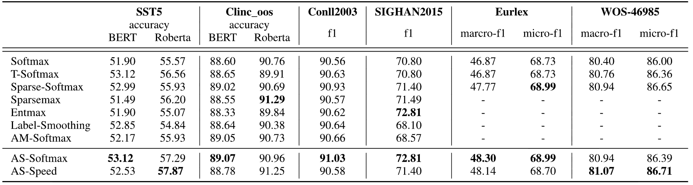

<div align="center">
<h2>Adaptive Sparse Softmax: An Effective and Efficient Softmax Variant</h2>

[**Qi Lv**](https://aopolin-lv.github.io/)<sup>1,4,\*</sup> · **Lei Geng**<sup>1,\*</sup> · [**Ziqiang Cao**](https://scholar.google.com/citations?user=06ITfcEAAAAJ&hl=en)<sup>1&dagger;</sup> · [**Min Cao**](https://scholar.google.com/citations?user=nhMWtZsAAAAJ&hl=en)<sup>1</sup> · [**Sujian Li**](https://scholar.google.com/citations?user=RvBDhSwAAAAJ&hl=en)<sup>2</sup> · [**Wenjie Li**](https://web.comp.polyu.edu.hk/cswjli/)<sup>3</sup> · [**Guohong Fu**](https://ieeexplore.ieee.org/author/37669159400)<sup>1&dagger;</sup>

<sup>1</sup>Soochow University&emsp;<sup>2</sup>Peking University&emsp;<sup>3</sup>The Hong Kong Polytechnic University&emsp;<sup>4</sup>Harbin Institute of Technology (Shenzhen)

<sup>*</sup>equal contribution&emsp;&emsp;<sup>&dagger;</sup>corresponding author

**TASLP**

<a href="https://ieeexplore.ieee.org/document/11098913"></a>
</div>

We propose the AS-Softmax algorithm, which improves the performance of the model with a reasonable and test-matching transformation on top of softmax.

## Usage Examples

### AS-Softmax

Basic usage example for single-label classification:

```python
from as_sm import AS_Softmax
import torch

# Prepare logits and labels
logits = torch.tensor([
    [1.2, 1.5, 1.0, -0.35],
    [2.5, 3.5, 0.4, 0.3],
    [2.5, 3.5, 0.4, 0.3]
])

labels = torch.tensor([1, 2, -100])

# Initialize AS-Softmax with delta parameter
as_softmax = AS_Softmax(delta=0.10)

# Apply AS-Softmax transformation
as_logits, labels = as_softmax(logits, labels)

# Output
print(as_logits)
# tensor([[-inf, 1.5000, -inf, -inf],
#         [2.5000, 3.5000, 0.4000, 0.3000],
#         [2.5000, 3.5000, -inf, -inf]])
```

### Multi-label AS-Softmax

Example for multi-label classification tasks:

```python
from as_sm import Multi_label_AS_Softmax
import torch

# Prepare logits and multi-labels
logits = torch.tensor([
    [1.2, 1.5, 1.0, -0.35],
    [2.5, 3.5, 0.4, 0.3],
    [2.5, 3.5, 0.4, 0.3]
])

multi_labels = torch.tensor([[1, 1, 0, 0], [0, 1, 1, 0], [1, 1, 0, 1]])

# Initialize Multi-label AS-Softmax
multi_label_as_softmax = Multi_label_AS_Softmax(delta=0.10)

# Get masks
mask_neg, mask_pos = multi_label_as_softmax(logits, multi_labels)

# Compute loss
loss = multi_label_as_softmax.as_multilabel_categorical_crossentropy(
    logits, multi_labels, mask_neg, mask_pos
)

print(loss)
# tensor(2.0778)
```

### AS-Speed

Example of using AS-Speed for adaptive gradient accumulation:

```python
from as_sm import compute_accumulation_step

# Initialize parameters
need_as_steps = 0  # If 0, accumulation steps need to be recalculated
as_speed_up = True  # Whether to accelerate training process
lamb = 1  # Lambda parameter
max_accu_steps = 2  # Maximum accumulation steps
as_accumulation_steps = 1

for step, inputs in enumerate(epoch_iterator):
    output = model(**inputs)
    step_loss = output['loss']

    if need_as_steps == 0:
        # Calculate new gradient accumulation steps after back propagation
        _, _, need_as_steps = compute_accumulation_step(
            output['logits'], lamb, as_speed_up
        )
        need_as_steps = max(need_as_steps, as_accumulation_steps)

        # Ensure the difference between two adjacent accumulation steps 
        # does not exceed 1
        if need_as_steps - as_accumulation_steps > 1:
            need_as_steps = as_accumulation_steps + 1

        # Accumulation steps can't exceed an upper limitation
        need_as_steps = min(max_accu_steps, need_as_steps)
        as_accumulation_steps = need_as_steps

        tr_loss_all = step_loss
    else:
        tr_loss_all += step_loss

    need_as_steps -= 1

    # Back propagation
    if need_as_steps == 0:
        tr_loss_all = tr_loss_all / as_accumulation_steps
        tr_loss_all.backward()
        tr_loss_all = tr_loss_all.detach()
        model.zero_grad()
```

## Installation

To install the required dependencies:

```bash
pip install -r requirements.txt
```

## Training and Evaluation

To train the model with AS-Softmax on the SST5 dataset, run:

```bash
python ./src/transformers/examples/pytorch/text_classification/run_sst5.py \
    --model_name_or_path bert-base-cased \
    --task_name sst5 \
    --do_train \
    --do_eval \
    --do_predict \
    --seed 42 \
    --max_seq_length 128 \
    --per_device_train_batch_size 16 \
    --learning_rate 2e-5 \
    --num_train_epochs 7 \
    --output_dir results \
    --fp16 \
    --cache_dir sst5 \
    --load_best_model_at_end True \
    --save_strategy steps \
    --logging_strategy steps \
    --evaluation_strategy steps \
    --save_steps 200 \
    --logging_steps 200 \
    --eval_steps 200 \
    --greater_is_better True \
    --metric_for_best_model accuracy \
    --overwrite_output_dir \
    --warmup_ratio 0.1 \
    --initial_as_delta 1.0 \
    --min_as_delta 0.10 \
    --as_speed_up False \
    --as_warm_up False \
    --ratio 0 \
    --accu_steps 2 \
    --accu_lambda 1 \
    --dataloader_num_workers 4 \
    --dataloader_pin_memory True
```

> **Note:** AS-Softmax has 2 main parameters (δ and r). In the command above, δ corresponds to `min_as_delta` and r corresponds to `ratio`. If `as_speed_up` is set to `True`, the AS-Speed algorithm is enabled, and `accu_steps` and `accu_lambda` parameters come into play.

## Results



## Citation
If you find this project useful, please consider citing:

```bibtex
@ARTICLE{11098913,
  author={Lv, Qi and Geng, Lei and Cao, Ziqiang and Cao, Min and Li, Sujian and Li, Wenjie and Fu, Guohong},
  journal={IEEE Transactions on Audio, Speech and Language Processing}, 
  title={Adaptive Sparse Softmax: An Effective and Efficient Softmax Variant}, 
  year={2025},
  volume={33},
  number={},
  pages={3148-3159},
  keywords={Training;Adaptation models;Overfitting;Speech processing;Entropy;Probability distribution;Computer science;Backpropagation;Standards;Propagation losses;Softmax;classification},
  doi={10.1109/TASLPRO.2025.3587436}}
```
